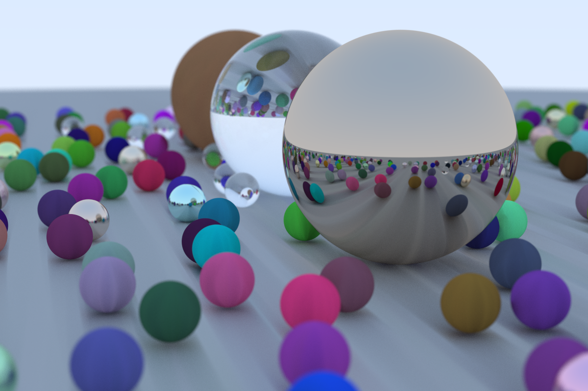

# ray

Raycaster based on [RayTracingInOneWeekend](https://raytracing.github.io/books/RayTracingInOneWeekend.html)

# Screenshots



# Running

```sh
$ cargo run --release --bin ray > /tmp/output.ppm && xdg-open /tmp/output.ppm &>/dev/null
```
